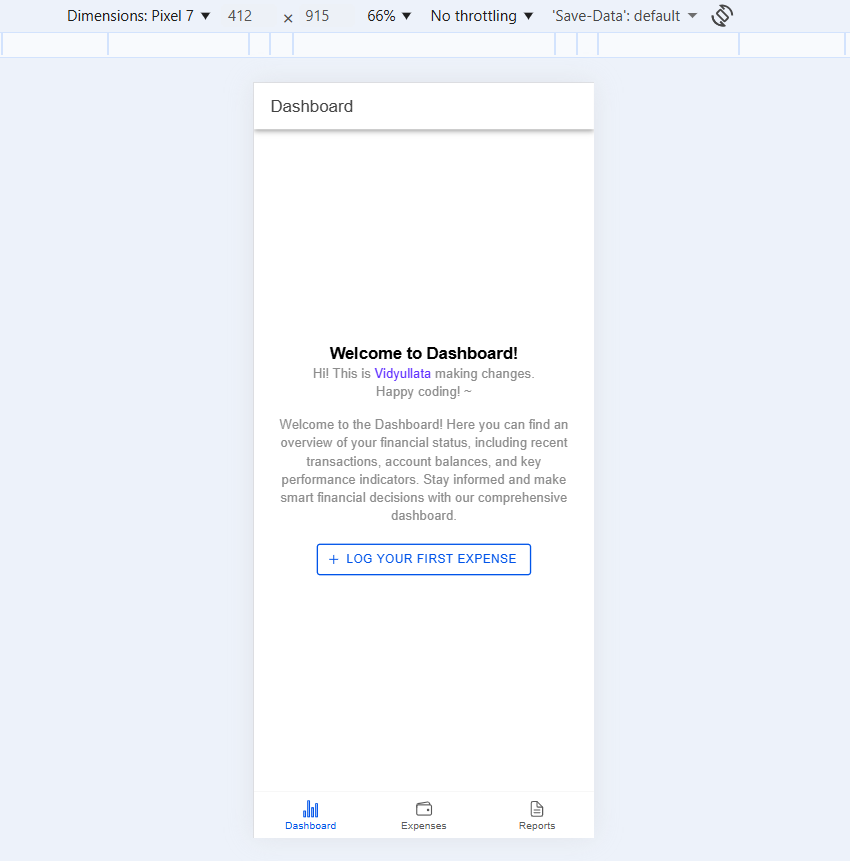
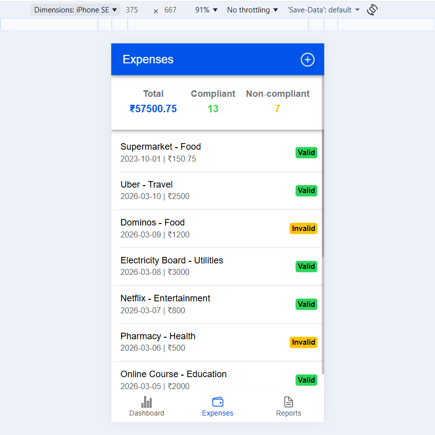
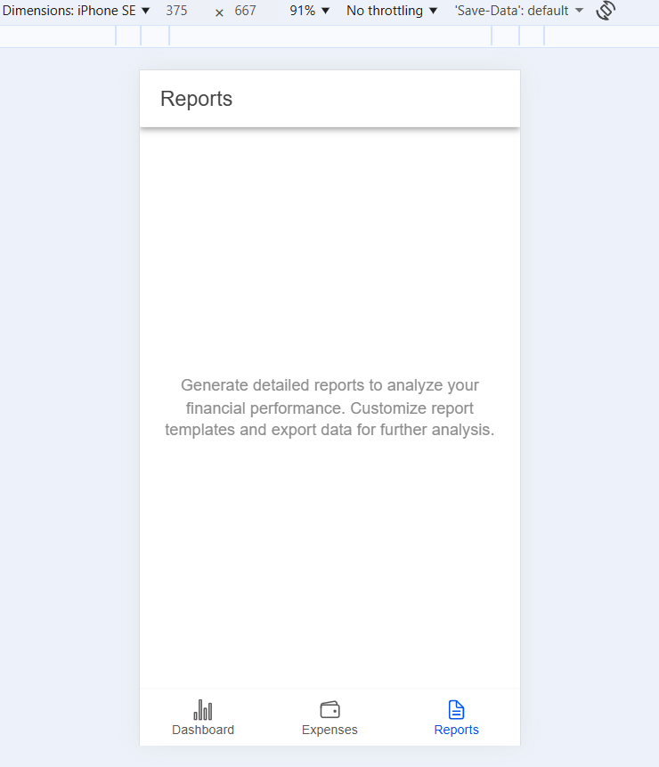

# Angular + Ionic Compliance Expense Tracker

A cross-platform hybrid mobile app built with **Angular + Ionic** that helps users log expenses, validate receipts against compliance rules, and generate secure reports. Designed with **enterprise-ready patterns** (NgRx, RxJS, JSON schema validation, secure APIs).

## 📸 Screenshots

Here are some previews of the Expense Tracker app:

### Dashboard:

### Expenses Page:

### Reports Page:

